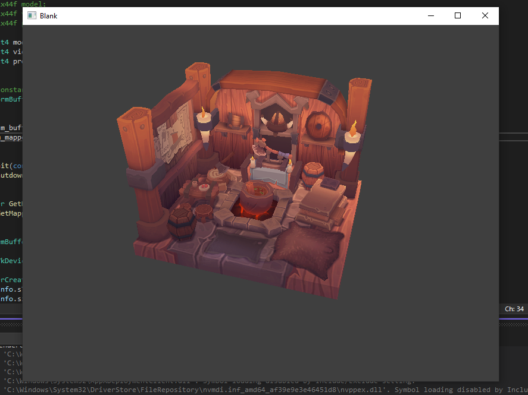

# Jupiter-Engine
I design, plan, write, test everything from scratch by myself

- C++ 20 Features
  - Modules. Replaced Pre-Compiled Headers for faster compilation speed
  - Concepts. Safer, and more flexible Templates magic
- Implemented my own STL
  - Containers, DynamicArray, HashMap, Red Black Tree, Graph, Heap
  - Strings Library
  - Smart Pointers and Memory Pool
  - Threading, Mutex, ThreadSafeQueue
  - Types, reflective Enums, Any, Variant, Tuple
- Implemented Json and CSV for Data-Driven
- Vulkan and DX12 renderer
- Core Systems. Input, Event System, Debugging, File IO, and more.
- GLFW and WIN32 frameworks

# Install and Run Jupiter on Windows
- Have Visual Studio 2022, and Vulkan 1.3.296.0 installed on your machine
- Clone this despository to any location on your PC.
- Add an Environment Variable. Set the name to JUPITER_ENGINE_DIR, and the value to Jupiter Engine's Root. Note it should end with '\\'. Example:
    - Correct: C:\Program Files\Jupiter Technologies\Jupiter-Engine\
    - Wrong:   C:\Program Files\Jupiter Technologies\Jupiter-Engine
- Compile shaders. Navigate to Jupiter-Engine/Scripts, run CompileShaders - GLSL.bat
- Build Visual Studio Solution and Projects. Navigate to Jupiter-Engine/Projects/Blank/Scripts, run GenerateProjectFiles_vs2022.bat. You will have Blank/_ProjectFiles, it contains the VS solution file
- You can build Jupiter Engine and Blank project now, enjoy
