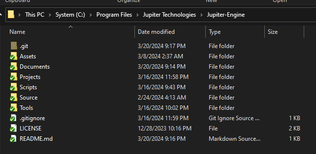

# Jupiter-Engine
Game Engine made by Zixuan Shi. I design, plan, write, test everything from scratch by myself

## Building and Running
Needed Tools:
- Visual Studio 2022 Community

Steps:
- Download Jupiter-Engine repository to C:\Program Files\Jupiter Technologies\Jupiter-Engine
  - It should looks like this 
  - open C:/Program Files/Jupiter Technologies/Jupiter-Engine/Projects/UnitTests/Scripts/GenerateProjectFiles_vs2022.bat
  - After batch file successful run, you will have generated visual studio files located at C:/Program Files/Jupiter Technologies/Jupiter-Engine/Projects/UnitTests/_ProjectFiles/UnitTests.sln
  - Now you can open the solution, build, and run the unit tests powered by Jupiter Engine!